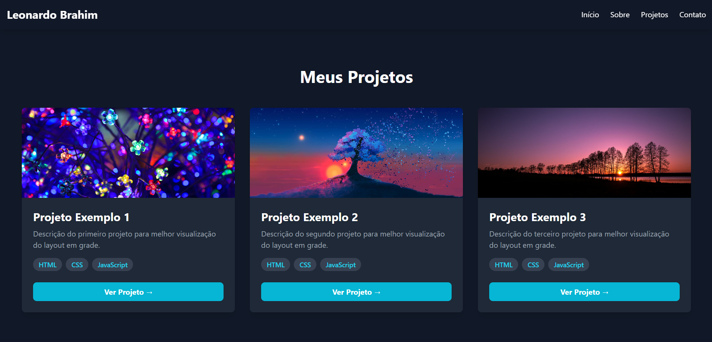

# Portfólio Pessoal - Leonardo Brahim

Bem-vindo ao repositório do meu portfólio pessoal! Este projeto foi criado com o objetivo de ser meu cartão de visitas digital, um lugar central para apresentar quem sou, as tecnologias com as quais trabalho e os projetos que desenvolvi.



## 🚀 Acesso ao Projeto

Você pode visualizar a versão ao vivo do meu portfólio aqui:
**[Clique para acessar](ainda-não-tenho-link)**

## ✨ Funcionalidades Principais

* **Design Moderno e Responsivo:** Interface limpa e totalmente adaptável para desktops, tablets e celulares.
* **Seção "Sobre":** Uma breve apresentação sobre mim e minhas principais habilidades (hard skills).
* **Seção "Projetos":** Uma galeria com cards dinâmicos para exibir meus trabalhos mais relevantes, com links para o código-fonte ou para a aplicação ao vivo.
* **Seção "Contato":** Links diretos para minhas redes sociais profissionais e e-mail, facilitando o contato.
* **Navegação Suave:** Scroll suave entre as seções para uma melhor experiência do usuário.

## 💻 Tecnologias Utilizadas

Este projeto foi desenvolvido utilizando as seguintes tecnologias:

* **[React.js](https://reactjs.org/):** Biblioteca JavaScript para a construção da interface de usuário.
* **[Vite](https://vitejs.dev/):** Ferramenta de build moderna que oferece uma experiência de desenvolvimento extremamente rápida.
* **[Tailwind CSS](https://tailwindcss.com/):** Framework de CSS utility-first para criar designs customizados de forma ágil.
* **HTML5 e CSS3:** Para a estruturação e estilização semântica.

## 🛠️ Como Rodar o Projeto Localmente

Se você quiser explorar o código ou rodar este projeto em sua máquina local, siga os passos abaixo:

1.  **Clone este repositório:**
    ```bash
    git clone [https://github.com/leonardobrahim/portifolio-leonardo-brahim.git](https://github.com/leonardobrahim/portifolio-leonardo-brahim.git)
    ```

2.  **Navegue até o diretório do projeto:**
    ```bash
    cd portifolio-leonardo-brahim
    ```

3.  **Instale as dependências:**
    ```bash
    npm install
    ```

4.  **Execute a aplicação em modo de desenvolvimento:**
    ```bash
    npm run dev
    ```

5.  Abra seu navegador e acesse `http://localhost:5173` (ou o endereço que aparecer no seu terminal).

## 📂 Estrutura de Arquivos

O projeto está organizado da seguinte forma para facilitar a manutenção e escalabilidade:

```
/
├── public/
├── src/
│   ├── assets/         # Imagens, ícones e outros arquivos estáticos
│   ├── components/     # Componentes React reutilizáveis (Header, ProjectCard, etc.)
│   ├── App.jsx         # Componente principal que une todas as seções
│   ├── index.css       # Estilos globais e diretivas do Tailwind CSS
│   └── main.jsx        # Ponto de entrada da aplicação React
├── .gitignore
├── index.html
├── package.json
├── README.md           # Você está aqui!
└── tailwind.config.js  # Arquivo de configuração do Tailwind
```

## 📬 Contato

Gostou do que viu? Vamos nos conectar!

* **LinkedIn:** [https://linkedin.com/in/leonardobrahim](https://www.linkedin.com/in/leonardo-brahim-tavares-837848208/)
* **E-mail:** [leonardobrahim@gmail.com](mailto:contato.leonardobrahim@gmail.com)

---
*Este projeto foi desenvolvido por Leonardo Brahim como uma forma de apresentar minhas habilidades e projetos.*